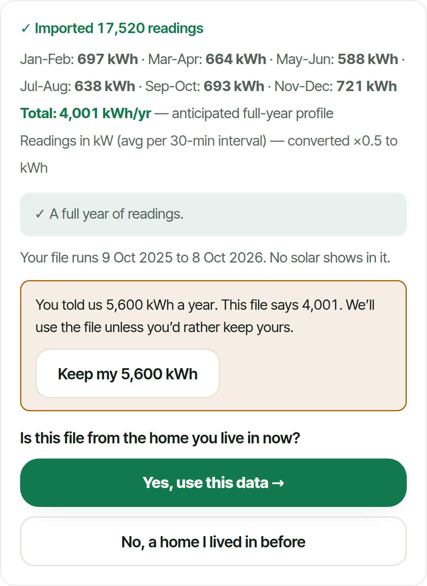
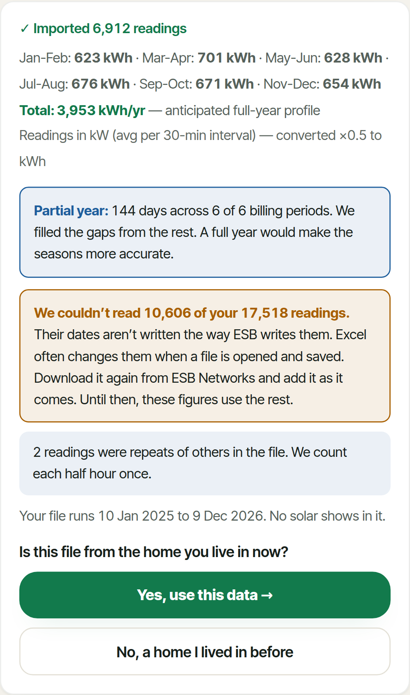
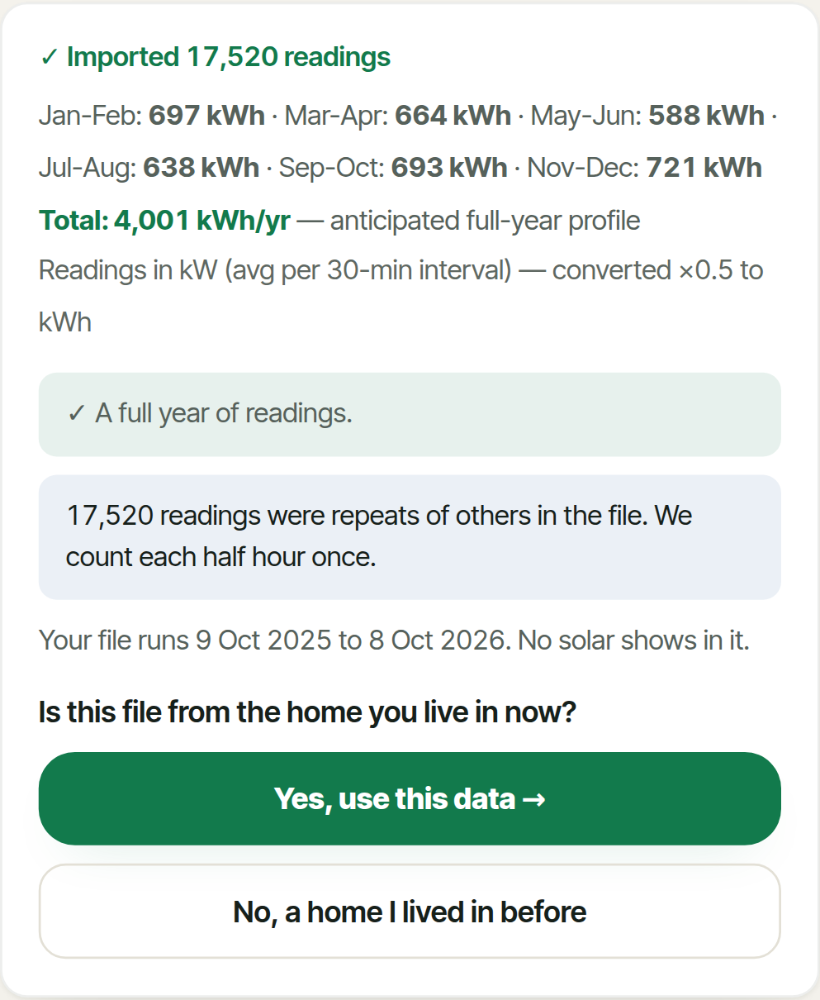
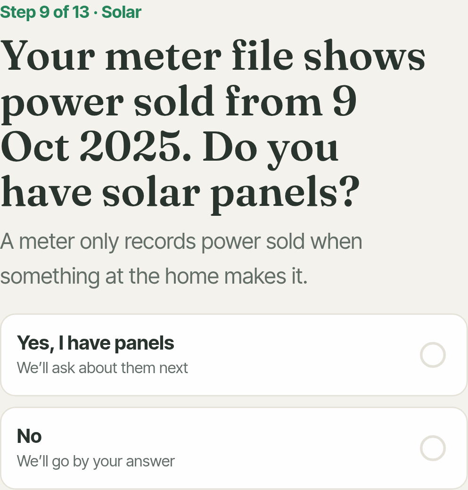

# Meter-file fixes, and two explanations

9 October 2026, on v8. The scenario tests are merged into v8, so the golden-households test runs on every push. Fixes 1 to 4 are in, one commit each, and each one tightened the golden limits for the homes it put right. Every number here comes from a run of the real app against homes whose true use and costs are known: all 71 scenarios on the build before each fix and after it.

- **All 71 scenarios: 29 passed before, 38 now.** Fix 1 (a lone midnight reading counted as a day): nine-month files of all three homes pass. Fix 2 (each half hour once): a doubled file reads 0.0% where it read +99.5%, and a file the app cannot read 60% of now says so. Fix 4 (ask instead of overriding): "no panels" with sales in the file -34.2% to -1.8%, a file from a previous home +87.1% to +5.0%.
- **The accuracy figure now moves (fix 3).** It covers the error found in 44 of 62 accepted files (31 before). Four winter weeks of a heat pump home show ±55% where they showed ±4%.
- **The golden test holds 20 homes** (14 before): the four user errors you named, D2a (must warn) and D6 (must say the file disagrees with what was typed). It now also holds the warnings, the questions asked and the accuracy figure.
- **B1 (question 4): the bill is negative, and the scoring compared two different years.** The app's bill for the tester-like home is negative in 2 of the 4 files. The percentages are large because the true bill is small: €332 a year. The "true" figure was the home's recorded year, which had 11 days without panels and six weeks of unpaid sales. The coming year with the panels up costs €275 on the same plan. The rest of the gap comes from what each file shows of the home: a year before the panels that was milder, and a summer or winter scaled up to a year.
- **The saving bias (question 5) has three causes, each measured.** For homes planning panels, two of the app's habits put together reproduce its figures to the kWh: its solar runs on winter time all summer, an hour early against the meter's clock, and its panels make 1.9% less than PVGIS. For battery homes the gap is all on the "without panels" side, which is worked back from the file. That home comes out 4% too small, and 41% to 55% of its use lands in the night hours, against 28.5% in truth. A night-rate plan then looks €137 to €300 a year cheaper than it is.
- **Real homes have a slot** (tests/fixtures/meter-scenarios/real/). Your ESB file with the Sigenergy export, and the tester's file, become scenarios with true figures. They stay out of git. A self-test on a made-up home recovers the stored truth exactly.

## The golden households, before and after

Each cell is the error against the truth: use / bill (payback in years against the true one, where the app shows one). Limits are use / bill / plan / payback; "acc" is the rule on the accuracy figure (covers the error, or may not fall below a figure). A limit only ever tightens. The one exception is recorded in golden.json with its reason: A5b-heatpump, where fix 1 removed a lone reading that had been hiding part of the error.

| Scenario | Limits before | Before | Fix 1 | Fix 2 | Fix 3 | Fix 4 | Limits now |
|---|---|---|---|---|---|---|---|
| **A1-gas**; Calendar year 2025 | 5% / 5% / €25 / 0.5 y; acc covers | -1.5% / -0.9%; payback 7.1 v 6.82 | -1.2% / -0.9%; payback 7.1 v 6.82 | -1.2% / -0.9%; payback 7.1 v 6.82 | -1.2% / -0.9%; payback 7.1 v 6.82 | -1.2% / -0.9%; payback 7.1 v 6.82 | 5% / 5% / €25 / 0.5 y; acc covers; asks: filehome |
| **A2-heatpump**; Twelve months, March 2025 to February 2026 | 5% / 5% / €25 / 0.5 y; acc covers | +0.5% / +0.6%; payback 6.1 v 5.78 | +0.8% / +0.6%; payback 6.1 v 5.78 | +0.8% / +0.6%; payback 6.1 v 5.78 | +0.8% / +0.6%; payback 6.1 v 5.78 | +0.8% / +0.6%; payback 6.1 v 5.78 | 5% / 5% / €25 / 0.5 y; acc covers; asks: filehome |
| **A7-ev**; Two years, October 2024 to October 2026 | 5% / 5% / €25 / 0.5 y; acc covers | +0.6% / 0.0%; payback 6.7 v 6.43 | +0.7% / 0.0%; payback 6.7 v 6.43 | +0.7% / 0.0%; payback 6.7 v 6.43 | +0.7% / 0.0%; payback 6.7 v 6.43 | +0.7% / 0.0%; payback 6.7 v 6.43 | 5% / 5% / €25 / 0.5 y; acc covers; asks: filehome |
| **A3a-gas**; Nine months, June 2025 to February 2026 (no spring) | 17.5% / 14% / €25 / 0.5 y; acc ≥ ±4% | -15.9% / -12.8%; payback 7.1 v 6.82 | +1.5% / +1.2%; payback 6.9 v 6.82 | +1.5% / +1.2%; payback 6.9 v 6.82 | +1.5% / +1.2%; payback 6.9 v 6.82 | +1.5% / +1.2%; payback 6.9 v 6.82 | 5% / 5% / €25 / 0.5 y; acc covers; asks: filehome |
| **A5b-heatpump**; Four winter weeks, January 2026 | 78% / 67.5% / €25 / 0.8 y; acc ≥ ±4% | +73.6% / +63.6%; payback 5.2 v 5.78 | +79.9% / +69.1%; payback 5.2 v 5.78 | +79.9% / +69.1%; payback 5.2 v 5.78 | +79.9% / +69.1%; payback 5.2 v 5.78 | +79.9% / +69.1%; payback 5.2 v 5.78 | 84.5% / 73.5% / €25 / 0.8 y; acc ≥ ±55%; asks: filehome |
| **B2-gas_solar**; A year after the panels, exports recorded | 5% / 5% / €25 / 0.5 y; acc covers | -1.8% / 0.0%; payback 6.9 v 6.77 | -1.8% / 0.0%; payback 6.9 v 6.77 | -1.8% / 0.0%; payback 6.9 v 6.77 | -1.8% / 0.0%; payback 6.9 v 6.77 | -1.8% / 0.0%; payback 6.9 v 6.77 | 5% / 5% / €25 / 0.5 y; acc covers; asks: filehome |
| **B2-hp_solar_batt**; A year after the panels, exports recorded | 5% / 5% / €25 / 1.2 y; acc ≥ ±4% | -4.4% / +0.1%; payback 7.2 v 6.2 | -4.4% / +0.1%; payback 7.2 v 6.2 | -4.4% / +0.1%; payback 7.2 v 6.2 | -4.4% / +0.1%; payback 7.2 v 6.2 | -4.4% / +0.1%; payback 7.2 v 6.2 | 5% / 5% / €25 / 1.2 y; acc ≥ ±4%; asks: filehome |
| **B3-friend**; Panels from 20 Oct 2025, exports recorded only from 1 Dec 2025 (the tester's case) | 5% / 5% / €25 / 0.5 y; acc covers; asks: filewhen | +3.7% / +0.5%; payback 5.9 v 5.72 | +3.7% / +0.5%; payback 5.9 v 5.72 | +3.7% / +0.5%; payback 5.9 v 5.72 | +3.7% / +0.5%; payback 5.9 v 5.72 | +3.7% / +0.5%; payback 5.9 v 5.72 | 5% / 5% / €25 / 0.5 y; acc covers; asks: filehome, filewhen |
| **B4a-gas_solar**; Before and after the panels (12 May 2025), exports recorded; user confirms the date | 5% / 5% / €25 / 0.5 y; acc covers; asks: filewhen | -2.9% / -1.9%; payback 6.9 v 6.77 | -2.9% / -1.9%; payback 6.9 v 6.77 | -2.9% / -1.9%; payback 6.9 v 6.77 | -2.9% / -1.9%; payback 6.9 v 6.77 | -2.9% / -1.9%; payback 6.9 v 6.77 | 5% / 5% / €25 / 0.5 y; acc covers; asks: filehome, filewhen |
| **B5-hp_solar_gridfill**; Battery filled from the grid at night in winter | 5% / 5% / €25 / 1.9 y; acc covers | -3.7% / +0.2%; payback 7.7 v 5.97 | -3.7% / +0.2%; payback 7.7 v 5.97 | -3.7% / +0.2%; payback 7.7 v 5.97 | -3.7% / +0.2%; payback 7.7 v 5.97 | -3.7% / +0.2%; payback 7.7 v 5.97 | 5% / 5% / €25 / 1.9 y; acc covers; asks: filehome |
| **C1-gas_ev_now**; EV bought on 1 Apr 2026, halfway through the file | 19% / 11.5% / €60 / 0.5 y; acc ≥ ±4% | -17.2% / -10.1%; payback 6.5 v 6.39 | -16.9% / -10.1%; payback 6.5 v 6.39 | -16.9% / -10.1%; payback 6.5 v 6.39 | -16.9% / -10.1%; payback 6.5 v 6.39 | -16.9% / -10.1%; payback 6.5 v 6.39 | 18.5% / 11.5% / €60 / 0.5 y; acc ≥ ±4%; asks: filehome |
| **D3b-gas**; Every row twice | 105% / 85% / €25 / 0.5 y; acc ≥ ±4% | +99.5% / +80.3%; payback 6.6 v 6.82 | +100.0% / +80.3%; payback 6.6 v 6.82 | 0.0% / 0.0%; payback 7.1 v 6.82 | 0.0% / 0.0%; payback 7.1 v 6.82 | 0.0% / 0.0%; payback 7.1 v 6.82 | 5% / 5% / €25 / 0.5 y; acc covers; warns: dupes; asks: filehome |
| **D3c-gas**; Two overlapping files uploaded one after the other | 5% / 5% / €25 / 0.5 y; acc covers | -0.8% / 0.0%; payback 7.1 v 6.82 | -0.1% / 0.0%; payback 7.1 v 6.82 | -0.1% / 0.0%; payback 7.1 v 6.82 | -0.1% / 0.0%; payback 7.1 v 6.82 | -0.1% / 0.0%; payback 7.1 v 6.82 | 5% / 5% / €25 / 0.5 y; acc covers; asks: filehome |
| **D5e-gas**; A PDF bill renamed .csv | turned away | turned away | turned away | turned away | turned away | turned away | turned away |
| **B3-gas_solar**; A year after the panels, no export rows | 36.5% / 88% / €25 / no payback yet; acc ≥ ±4%; asks: filewhen | -34.2% / +83.0%; no payback | -34.0% / +83.0%; no payback | -34.0% / +83.0%; no payback | -34.0% / +83.0%; no payback | -34.0% / +83.0%; no payback | 36.5% / 88% / €25 / no payback yet; acc ≥ ±4%; asks: filehome, filewhen |
| **B6-gas_solar**; User says no solar; the file shows exports | 36.5% / 5% / €25 / no payback yet; acc ≥ ±7% | -34.2% / 0.0%; no payback | -34.0% / 0.0%; no payback | -34.0% / 0.0%; no payback | -34.0% / 0.0%; no payback | -1.8% / 0.0%; payback 6.9 v 6.77 | 5% / 5% / €25 / 0.5 y; acc covers; asks: fileexp, filehome |
| **B8-gas_solar**; User says 14 panels; the home has 9 | 53% / 5% / €25 / 3 y; acc ≥ ±4% | +49.9% / 0.0%; payback 4.1 v 6.77 | +49.9% / 0.0%; payback 4.1 v 6.77 | +49.9% / 0.0%; payback 4.1 v 6.77 | +49.9% / 0.0%; payback 4.1 v 6.77 | +49.9% / 0.0%; payback 4.1 v 6.77 | 53% / 5% / €25 / 3 y; acc ≥ ±4%; asks: filehome |
| **C3-moved**; Moved house: the file is the old (heat pump) home; the new home is gas-heated | 92% / 75% / €25 / 0.9 y; acc ≥ ±4% | +87.1% / +70.5%; payback 6.1 v 6.82 | +87.5% / +70.5%; payback 6.1 v 6.82 | +87.5% / +70.5%; payback 6.1 v 6.82 | +87.5% / +70.5%; payback 6.1 v 6.82 | +5.0% / +4.0%; payback 6.4 v 6.82 | 5% / 5% / €25 / 0.5 y; acc covers; asks: filehome |
| **D2a-gas**; Edited in Excel: US dates (MM/DD) | not in the set | -1.5% / -1.2%; payback 6.9 v 6.82; 60.5% unread, no warning | -1.2% / -0.9%; payback 6.9 v 6.82; 60.5% unread, no warning | -1.2% / -0.9%; payback 6.9 v 6.82; 60.5% unread, warned | -1.2% / -0.9%; payback 6.9 v 6.82; 60.5% unread, warned | -1.2% / -0.9%; payback 6.9 v 6.82; 60.5% unread, warned | 5% / 5% / €25 / 0.5 y; acc covers; warns: unread; asks: filehome |
| **D6-gas**; Typed 5,600 kWh in setup, then uploaded a file showing 4,000 | not in the set | -0.2% / 0.0%; payback 7.1 v 6.82 | 0.0% / 0.0%; payback 7.1 v 6.82 | 0.0% / 0.0%; payback 7.1 v 6.82 | 0.0% / 0.0%; payback 7.1 v 6.82 | 0.0% / 0.0%; payback 7.1 v 6.82 | 5% / 5% / €25 / 0.5 y; acc covers; warns: typed; asks: filehome, typed |

## All 71 scenarios, fix by fix

| Build | Commit | Pass | Fail | Turned away | Accuracy shown covers the error |
|---|---|---|---|---|---|
| Before | `90c7db3` | 29 | 33 | 9 | 31 of 62 |
| Fix 1 | `8f633d6` | 33 | 29 | 9 | 35 of 62 |
| Fix 2 | `93b4f6d` | 36 | 26 | 9 | 37 of 62 |
| Fix 3 | `edba4a1` | 36 | 26 | 9 | 42 of 62 |
| Fix 4 | `a9a2db6` | 38 | 24 | 9 | 44 of 62 |
| Now (with the card fix) | `708262f` | 38 | 24 | 9 | 44 of 62 |

Every scenario whose figures changed, before and now. Use / bill / payback; the accuracy shown; the result.

| ID | Scenario | Before |  | Now |  |
|---|---|---|---|---|---|
| A1-gas | Calendar year 2025 | -1.5% / -0.9%; payback 7.1 v 6.82; ±4% | pass | -1.2% / -0.9%; payback 7.1 v 6.82; ±4% | pass |
| A1-heatpump | Calendar year 2025 | -5.5% / -4.6%; payback 6.1 v 5.78; ±4% | FAIL: consumption | -5.2% / -4.6%; payback 6.1 v 5.78; ±4% | FAIL: consumption |
| A1-ev | Calendar year 2025 | -0.8% / -0.1%; payback 6.7 v 6.43; ±4% | pass | -0.5% / -0.1%; payback 6.7 v 6.43; ±4% | pass |
| A2-gas | Twelve months, March 2025 to February 2026 | -0.9% / -0.5%; payback 7.1 v 6.82; ±4% | pass | -0.7% / -0.5%; payback 7.1 v 6.82; ±4% | pass |
| A2-heatpump | Twelve months, March 2025 to February 2026 | +0.5% / +0.6%; payback 6.1 v 5.78; ±4% | pass | +0.8% / +0.6%; payback 6.1 v 5.78; ±4% | pass |
| A2-ev | Twelve months, March 2025 to February 2026 | +1.8% / +0.7%; payback 6.7 v 6.43; ±4% | pass | +2.1% / +0.7%; payback 6.7 v 6.43; ±4% | pass |
| A3a-gas | Nine months, June 2025 to February 2026 (no spring) | -15.9% / -12.8%; payback 7.1 v 6.82; ±4% | FAIL: consumption, bill | +1.5% / +1.2%; payback 6.9 v 6.82; ±6% | pass |
| A3a-heatpump | Nine months, June 2025 to February 2026 (no spring) | -17.8% / -15.8%; payback 6.3 v 5.78; ±4% | FAIL: consumption, bill | -1.1% / -1.0%; payback 6.0 v 5.78; ±15% | pass |
| A3a-ev | Nine months, June 2025 to February 2026 (no spring) | -13.3% / -11.5%; payback 6.7 v 6.43; ±4% | FAIL: consumption, bill, plan | +4.6% / +6.8%; payback 6.4 v 6.43; ±6% | pass |
| A3b-gas | Nine months, September 2025 to May 2026 (no summer) | -0.9% / -0.7%; payback 6.9 v 6.82; ±4% | pass | -0.3% / -0.2%; payback 6.9 v 6.82; ±6% | pass |
| A3b-heatpump | Nine months, September 2025 to May 2026 (no summer) | +8.1% / +7.2%; payback 5.8 v 5.78; ±4% | pass | +8.6% / +7.6%; payback 5.8 v 5.78; ±15% | pass |
| A3b-ev | Nine months, September 2025 to May 2026 (no summer) | -2.6% / -1.8%; payback 6.5 v 6.43; ±4% | FAIL: plan | -2.0% / -1.3%; payback 6.5 v 6.43; ±6% | FAIL: plan |
| A4-gas | This year so far, 1 January to 8 October 2026 | 0.0% / 0.0%; payback 6.9 v 6.82; ±4% | pass | +0.6% / +0.5%; payback 6.9 v 6.82; ±5% | pass |
| A4-heatpump | This year so far, 1 January to 8 October 2026 | -3.3% / -2.9%; payback 6.0 v 5.78; ±4% | pass | -2.9% / -2.6%; payback 6.0 v 5.78; ±15% | pass |
| A4-ev | This year so far, 1 January to 8 October 2026 | +0.6% / +0.8%; payback 6.5 v 6.43; ±4% | FAIL: plan | +1.1% / +1.2%; payback 6.5 v 6.43; ±5% | FAIL: plan |
| A5a-gas | Four summer weeks, July 2026 | -7.0% / -5.6%; payback 7.1 v 6.82; ±4% | pass | -3.7% / -2.9%; payback 7.1 v 6.82; ±15% | pass |
| A5a-heatpump | Four summer weeks, July 2026 | -45.2% / -40.0%; payback 6.7 v 5.78; ±4% | FAIL: consumption, bill | -43.3% / -38.3%; payback 6.7 v 5.78; ±55% | FAIL: consumption, bill |
| A5a-ev | Four summer weeks, July 2026 | -9.1% / -7.3%; payback 6.5 v 6.43; ±4% | FAIL: plan | -5.9% / -4.4%; payback 6.5 v 6.43; ±15% | FAIL: plan |
| A5b-gas | Four winter weeks, January 2026 | 0.0% / 0.0%; payback 7.0 v 6.82; ±4% | pass | +3.5% / +2.9%; payback 7.0 v 6.82; ±15% | pass |
| A5b-heatpump | Four winter weeks, January 2026 | +73.6% / +63.6%; payback 5.2 v 5.78; ±4% | FAIL: consumption, bill | +79.9% / +69.1%; payback 5.2 v 5.78; ±55% | FAIL: consumption, bill |
| A5b-ev | Four winter weeks, January 2026 | -2.1% / -1.4%; payback 6.6 v 6.43; ±4% | FAIL: plan | +1.4% / +1.7%; payback 6.5 v 6.43; ±15% | FAIL: plan |
| A5c-gas | Two summer weeks, August 2026 | -8.4% / -6.8%; payback 6.8 v 6.82; ±4% | pass | -1.8% / -1.5%; payback 6.8 v 6.82; ±15% | pass |
| A5c-heatpump | Two summer weeks, August 2026 | -41.5% / -36.8%; payback 6.6 v 5.78; ±4% | FAIL: consumption, bill | -37.4% / -33.1%; payback 6.5 v 5.78; ±58% | FAIL: consumption, bill |
| A5c-ev | Two summer weeks, August 2026 | -12.2% / -9.1%; payback 6.5 v 6.43; ±4% | FAIL: plan | -5.9% / -3.7%; payback 6.4 v 6.43; ±15% | FAIL: plan |
| A6-gas | An old year, July 2024 to June 2025 | -1.6% / -1.2%; payback 7.1 v 6.82; ±4% | pass | -1.4% / -1.2%; payback 7.1 v 6.82; ±4% | pass |
| A6-heatpump | An old year, July 2024 to June 2025 | -4.2% / -3.7%; payback 6.1 v 5.78; ±4% | pass | -4.0% / -3.7%; payback 6.1 v 5.78; ±4% | pass |
| A6-ev | An old year, July 2024 to June 2025 | -0.1% / -0.3%; payback 6.8 v 6.43; ±4% | pass | +0.1% / -0.3%; payback 6.8 v 6.43; ±4% | pass |
| A7-gas | Two years, October 2024 to October 2026 | -0.8% / 0.0%; payback 7.1 v 6.82; ±4% | pass | -0.7% / 0.0%; payback 7.1 v 6.82; ±4% | pass |
| A7-heatpump | Two years, October 2024 to October 2026 | -2.0% / +0.1%; payback 6.1 v 5.78; ±4% | pass | -1.9% / +0.1%; payback 6.1 v 5.78; ±4% | pass |
| A7-ev | Two years, October 2024 to October 2026 | +0.6% / 0.0%; payback 6.7 v 6.43; ±4% | pass | +0.7% / 0.0%; payback 6.7 v 6.43; ±4% | pass |
| B1a-friend | Full year before the panels | -4.5% / -46.3%; payback 5.1 v 5.72; ±4% | FAIL: bill, payback | -4.3% / -46.3%; payback 5.1 v 5.72; ±4% | FAIL: bill, payback |
| B1b-friend | Half year before the panels | -23.7% / -145.9%; payback 5.4 v 5.72; ±4% | FAIL: consumption, bill | -23.3% / -144.0%; payback 5.3 v 5.72; ±30% | FAIL: consumption, bill |
| B1c-friend | Summer before the panels | -55.6% / -220.1%; payback 5.8 v 5.72; ±4% | FAIL: consumption, bill, plan | -34.4% / -156.7%; payback 5.5 v 5.72; ±45% | FAIL: consumption, bill, plan |
| B1d-friend | Winter before the panels | -14.6% / -77.7%; payback 5.4 v 5.72; ±4% | FAIL: consumption, bill | +27.8% / +71.6%; payback 4.5 v 5.72; ±45% | FAIL: consumption, bill, payback |
| B3-gas_solar | A year after the panels, no export rows | -34.2% / +83.0%; no payback; ±4% | FAIL: consumption, bill, no payback shown | -34.0% / +83.0%; no payback; ±4% | FAIL: consumption, bill, no payback shown |
| B4c-gas_solar | Before and after the panels, no export rows; user confirms the date shown | -3.0% / -0.7%; payback 7.0 v 6.77; ±4% | pass | -3.0% / -0.7%; payback 7.0 v 6.77; ±7% | pass |
| B6-gas_solar | User says no solar; the file shows exports | -34.2% / 0.0%; no payback; ±7% | FAIL: consumption, no payback shown | -1.8% / 0.0%; payback 6.9 v 6.77; ±4% | pass |
| B7a-gas | User says they have 9 panels; the file shows a home without them (they have none) | -0.2% / 0.0%; no payback; ±4% | FAIL: no payback shown | 0.0% / 0.0%; no payback; ±4% | FAIL: no payback shown |
| B7b-gas | Same; user answers that the file is from before the panels | -0.2% / -58.3%; payback 7.1 v 6.82; ±4% | FAIL: bill | 0.0% / -58.3%; payback 7.1 v 6.82; ±4% | FAIL: bill |
| C1-gas_ev_now | EV bought on 1 Apr 2026, halfway through the file | -17.2% / -10.1%; payback 6.5 v 6.39; ±4% | FAIL: consumption, bill, plan | -16.9% / -10.1%; payback 6.5 v 6.39; ±4% | FAIL: consumption, bill, plan |
| C2-gas_to_hp | Heat pump put in on 15 Jan 2026 (was gas) | -17.4% / -15.4%; payback 6.3 v 5.79; ±4% | FAIL: consumption, bill | -17.2% / -15.4%; payback 6.3 v 5.79; ±4% | FAIL: consumption, bill |
| C4-gas_holiday | Away for four weeks in August 2026 | -5.2% / -4.0%; payback 7.2 v 6.82; ±4% | FAIL: consumption | -5.0% / -4.0%; payback 7.2 v 6.82; ±4% | pass |
| C3-moved | Moved house: the file is the old (heat pump) home; the new home is gas-heated | +87.1% / +70.5%; payback 6.1 v 6.82; ±4% | FAIL: consumption, bill, payback | +5.0% / +4.0%; payback 6.4 v 6.82; ±6% | pass |
| D1b-gas | Half-hourly file in kWh, not kW | -0.3% / 0.0%; payback 7.1 v 6.82; ±4% | pass | 0.0% / 0.0%; payback 7.1 v 6.82; ±4% | pass |
| D2a-gas | Edited in Excel: US dates (MM/DD) | -1.5% / -1.2%; payback 6.9 v 6.82; 60.5% unread, no warning; ±4% | FAIL: lost readings, no warning | -1.2% / -0.9%; payback 6.9 v 6.82; 60.5% unread, warned; ±17% | pass |
| D2d-gas | Saved by Excel with Irish short dates (d/m/yyyy h:mm) | -0.2% / 0.0%; payback 7.1 v 6.82; ±4% | pass | 0.0% / 0.0%; payback 7.1 v 6.82; ±4% | pass |
| D3a-gas | Missing days: ten single days and a three-week gap | -0.8% / -2.6%; payback 7.1 v 6.82; ±4% | pass | -0.6% / -2.6%; payback 7.1 v 6.82; ±4% | pass |
| D3b-gas | Every row twice | +99.5% / +80.3%; payback 6.6 v 6.82; ±4% | FAIL: consumption, bill | 0.0% / 0.0%; payback 7.1 v 6.82; ±4% | pass |
| D3c-gas | Two overlapping files uploaded one after the other | -0.8% / 0.0%; payback 7.1 v 6.82; ±4% | pass | -0.1% / 0.0%; payback 7.1 v 6.82; ±4% | pass |
| D3d-gas | Meter replaced in March: two serial numbers in one file | -0.2% / 0.0%; payback 7.1 v 6.82; ±4% | pass | 0.0% / 0.0%; payback 7.1 v 6.82; ±4% | pass |
| D4-gas | Calendar 2024: 29 February and both clock changes | -1.2% / -1.0%; payback 7.1 v 6.82; ±4% | pass | -0.9% / -1.0%; payback 7.1 v 6.82; ±4% | pass |
| D5f-gas | A very large file (the same 33 months five times, about 14 MB) | +396.5% / +321.4%; payback 5.9 v 6.82; ±4% | FAIL: consumption, bill, payback | -0.6% / 0.0%; payback 7.1 v 6.82; ±4% | pass |
| D6-gas | Typed 5,600 kWh in setup, then uploaded a file showing 4,000 | -0.2% / 0.0%; payback 7.1 v 6.82; ±4% | pass | 0.0% / 0.0%; payback 7.1 v 6.82; ±4% | pass |

### What the person sees now

*Typed 5,600 kWh in setup, then a file showing 4,001: said, with the choice to keep it (fix 4). Every upload now asks whether the file is from the home lived in now.*

*A file opened and saved in Excel with US dates: 60.5% of its readings unreadable, and the card says so (fix 2).*

*Every row twice: counted once, and said (fix 2).*

*"No panels", with sales in the file from the first day: asked (fix 4).*

## Question 4: the B1 bills of -46% to -220%

B1 is the tester-like home (heat pump, 22 panels on two faces, a 9 kWh battery that stores only solar) with a file from before the panels. The app adds the stated panels and battery to the file and prices the year. The scored figure is the app's answer for a battery that stores only solar; its headline assumes night filling and is shown beside it.

| ID | File | True use in the file | App's year | App's plan | App: bill | App: headline | True: recorded year | True: coming year | Now (after fix 1) |
|---|---|---|---|---|---|---|---|---|---|
| B1a-friend | Full year before the panels | 6,221 kWh in 365 days | 6,206 (-4.5%) | Electric Ireland Home Electric + SST Saver 16% | €178 | €26 | €332 | €289 | 6,219, €178 |
| B1b-friend | Half year before the panels | 2,298 kWh in 183 days | 4,960 (-23.7%) | Electric Ireland Home Electric + SST Saver 16% | −€152 | −€247 | €332 | €289 | 4,985, −€146 |
| B1c-friend | Summer before the panels | 1,015 kWh in 92 days | 2,884 (-55.6%) | Pinergy Lifestyle Family Time | −€693 | −€710 | €577 | €633 | 4,264, −€327 |
| B1d-friend | Winter before the panels | 2,119 kWh in 90 days | 5,551 (-14.6%) | Electric Ireland Home Electric + SST Saver 16% | €74 | −€64 | €332 | €289 | 8,304, €569 |

- **Yes, the bill is negative.** On the scored answer it is negative for 2 of the 4 files; on the headline, for 3. A 9.7 kWp system with a battery takes this home from €2,184 a year without panels to €275 to €332 with them, so a negative bill says the panels would earn more than the home spends.
- **The percentages are large because the true figure is small.** €100 on a €332 bill is 30%. In euro, the errors are €154, €484, €1,270 and €258.
- **The scoring did compare two different things.** The true bill was the home's recorded year (9 Oct 2025 to 8 Oct 2026): eleven days before the panels went up, then six weeks when ESB did not yet record sales, so they were not paid. The app works out the coming year, with the panels up and sales paid from the first day. That year costs €275 on Electric Ireland's SST plan with the reference battery, or €289 with a battery run as the app runs its own (92% round trip, 10% kept back, held through the night). The recorded year costs €332. Against the coming year, B1a's error is €111 (−38%), not −46%. The B3-friend file is that recorded year, priced from its own readings, so there the two agree: €333 against €332.
- **What is left is the file.** B1a's year before the panels used 6,221 kWh, and the app read 6,206. That year was milder than the coming one (6,500 kWh), and the app's panels on these two faces make +148 kWh against PVGIS. So it buys less and sells more. B1b to B1d scale a half year, a summer or a winter up to a year, as the partial files A3 to A5 do. A heat pump home's summer is a third of its winter, so the year is read low from a summer and high from a winter. Fix 1 changed these (B1d now reads high: it had been held down by the lone midnight reading). Fix 3 now shows ±30% to ±45% on them, where it showed ±4%.
- The headline's night filling is a separate matter. On these plans it moves the answer to Electric Ireland Night Boost, €118 a year dearer than the solar-only best: that is the "Ask how a battery charges also when a file is uploaded" item (fix 6). Holding the battery through the night, as the app does on a night-rate plan, costs this home only €3 a year (€275 against €278 with the reference battery), so it is not a cause.

So the scoring change for later: score a file from before the panels against the coming year with the panels up all year, as above, not against the recorded year. B1a would then read -38% (−€111) rather than -46.3%.

## Question 5: where the saving bias comes from

The saving is the cheapest plan without the panels less the cheapest plan with them, for the coming year. For homes planning panels the app's figure was 3.7% to 5.0% low; for battery homes 14% to 22% low. Each part below was measured: on the app (its own simulation, read out of the running page) and on the true homes (the truth's simulation, with one of the app's habits switched on at a time).

### Homes planning panels: two habits, both in the with-solar year

| Home | True saving | Solar an hour early in summer | Panels 1.9% lower | Both | The app |
|---|---|---|---|---|---|
| gas (A7-gas) | €880; sold 2,556, used 1,357 | €862 (-2.0%); used 1,285 | €864 (-1.8%) | €847; bought 2,724, sold 2,565 | €847; bought 2,723, sold 2,565 |
| heat pump (A7-heatpump) | €1,037; sold 1,919, used 1,994 | €1,015 (-2.1%); used 1,965 | €1,020 (-1.6%) | €999; bought 5,553, sold 1,893 | €985; bought 5,630, sold 1,965 |
| EV (A7-ev) | €934; sold 2,644, used 1,270 | €909 (-2.6%); used 1,195 | €918 (-1.7%) | €893; bought 4,813, sold 2,654 | €892; bought 4,816, sold 2,657 |

- **The app's solar runs on winter time all year.** On 21 June its 4 kWp system makes power from 04:00 and peaks at 12:00 to 13:00. The sun is highest at about 13:30 Irish summer time. The meter's readings, and every plan's hours, are on the clock. So from late March to late October the panels run an hour early against the home: less is used at home and more sold for less. On the true gas home this alone takes 72 kWh off what is used at home and 2.0% off the saving.
- **The app's panels make 1.9% less than PVGIS** for 4 kWp facing south at 35° in Cork (3,841 kWh against 3,914). On the tester-like home's two faces it is the other way, +1.9% (7,777 against 7,629). So it is the panel model's allowance for direction that is off, not its overall level.
- **The two together reproduce the app.** On the gas home: bought 2,724 kWh (app 2,723), sold 2,565 (app 2,565), saving €847 (app €847). The no-panels side is right: €1,453 against €1,453. The heat pump and EV homes come within €14, the rest being their use read slightly low.

### Battery homes: the "without panels" home worked back from the file

| Home | With panels: app / true | Home without panels: kWh, app / true | On a flat-rate plan: app / true | Night share 23:00-08:00: app / true | App's cheapest without panels | Saving: app / true |
|---|---|---|---|---|---|---|
| B2-hp_solar_batt | €847 / €846 | 7,174 / 7,500 | €2,381 / €2,476 (−€95) | 41.1% / 28.5% | Electric Ireland Home Electric + SST Saver 16%, €2,244: €137 under the flat plan | €1,397 / €1,630 (-14.3%) |
| B5-hp_solar_gridfill | €785 / €784 | 7,233 / 7,500 | €2,398 / €2,476 (−€78) | 54.7% / 28.5% | Electric Ireland Home Electric + SST Saver 16%, €2,098: €300 under the flat plan | €1,313 / €1,692 (-22.4%) |

- **With the panels, the app is exact**: these files are priced from their own readings.
- **The home without panels is too small**: 7,174 kWh against 7,500. It is worked back as what was bought, plus what the stated panels make in a typical year, less what was sold, less 8% of the solar used for battery losses. The app's 6 kWp makes 5,737 kWh in its typical year against 5,905 in this one. Its battery allowance takes off 260 kWh where the battery lost 93. On a flat-rate plan that is the €95 and €78 above.
- **And its hours are wrong.** They come from the usage pattern read off what the meter bought. A battery has already moved that buying into the night, and a battery filled from the grid in winter more so. So 41.1% and 54.7% of the no-panels home's use land between 23:00 and 08:00, against 28.5% in the true home. On 16 January it uses 0.7 kWh an hour through the day and 1.9 through the night. A night-rate plan then looks €137 and €300 cheaper than a flat one, where in truth it is €13 dearer.

## What the explanations point to (for your approval)

Not implemented. Ranked as before, impact against effort, and continuing the earlier list.

| # | Fix | Impact | Effort | Scenarios |
|---|---|---|---|---|
| 12 | Put the panels on the clock the meter keeps (summer time from late March to late October) | High: every solar saving and payback, +2.0% to +2.6% | Small | A, B |
| 13 | Work the battery home's no-panels hours out from its days before the panels, or the heating profile, not from what the meter bought | High for battery homes: saving -14% and -22% today | Small | B2-hp_solar_batt, B5, B3-friend |
| 14 | Battery losses when working use back: the battery's own losses in place of 8% of the solar used | Medium: use −4% on battery homes | Small | B2, B4d, B5 |
| 15 | Check the panel model against PVGIS face by face (-1.9% facing south, +1.9% on south-west and north-east) | Medium | Medium | All solar |
| 16 | Score a file from before the panels against the coming year with the panels up all year | Scoring only | Small | B1 |

## Fix 5, later: as you set it out

For a solar file with no export rows yet, export data will not be made up. The answers will include "Panels were up the whole time; sales aren't on the file yet". With it, the result is shown as an estimate: the home's use is worked back from the stated panels, the sales are what those panels would sell, and the accuracy figure is widened for both. The golden homes for it are already in place: B3-gas_solar today reads −34.0% use, +83.0% bill and no payback, and must show a payback once fixed.

## Real homes: ready for your files

- Folder: `tests/fixtures/meter-scenarios/real/private/<id>/` (git ignores it). Put in it the ESB file (My Meter, Downloads, "30-minute readings in kW"), the Sigenergy export for the same twelve months at its finest interval (CSV or Excel), and `home.json` from `home.example.json`: your setup answers and the system as installed.
- `add_home.py <folder>` replaces the MPRN and meter serial. It reads the Sigenergy columns by their names and finds out whether its rows are stamped at the start or end of each interval, by lining its sales up with the meter file's. It prints both files' bought and sold totals side by side, then writes the truth: the bills on every plan from the meter file, the home's use from Sigenergy, and the saving and payback from that use.
- The tester's file without generation data scores the bills and the best plan; use and payback need generation.
- They stay out of git: half-hourly readings show when a home is in, out and asleep. To put one in the golden test, its owner has to agree to the anonymised file being committed. The tester has to agree for theirs.
- `add_home.py --selftest` builds the tester's case with five-minute Sigenergy-style rows stamped at the end, recovers the stored truth exactly (6,500 kWh, €331.50, payback 5.72), and scores through the app as B3-friend does.

## How it was run

Each build: `SCENARIO_OUT=<dir> npx playwright test meter-scenarios --grep @scenarios` (all 71, the plan list and date frozen), then `python3 tests/fixtures/meter-scenarios/score.py <dir>` and `make_golden.py <dir>`. The scores and golden.json after each fix are in `stages/`. The explanation runs are in `explain/`: the app's own figures were read out of the running page (`app/`, from the build before the fixes, with the probe specs kept as .txt), and the truth's were rerun with one habit at a time (`shift_test.py`, `truth_parts.py`, `b1_parts.py`).
