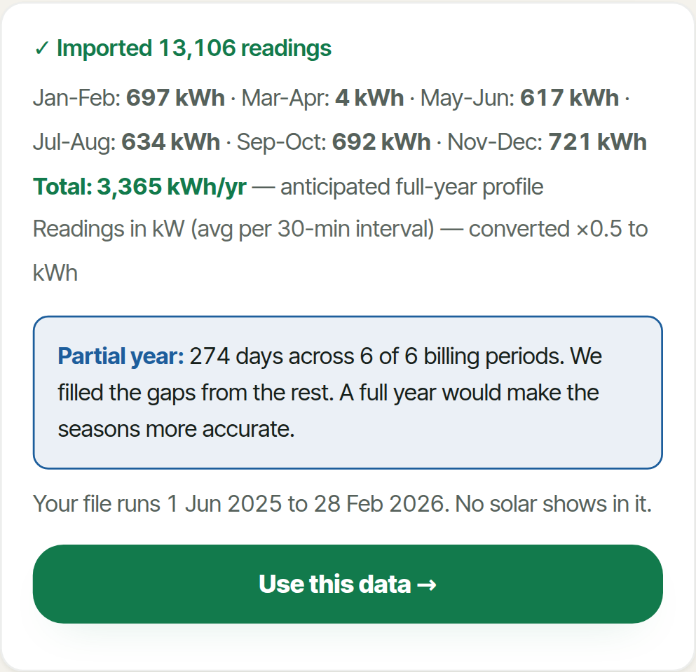
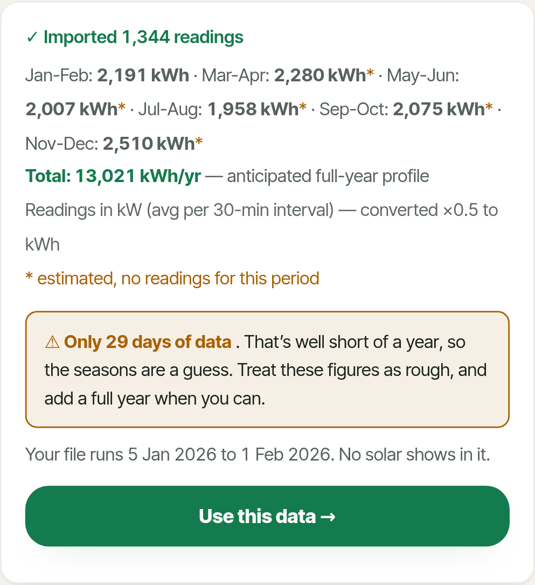
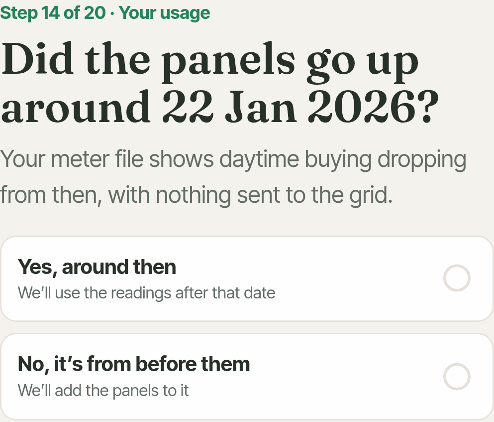
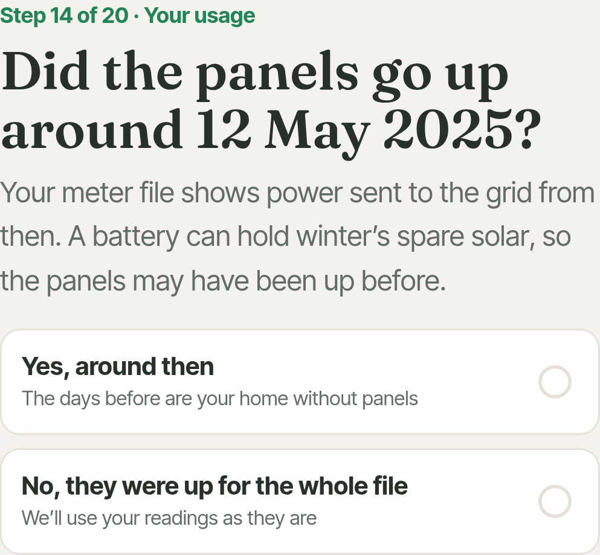
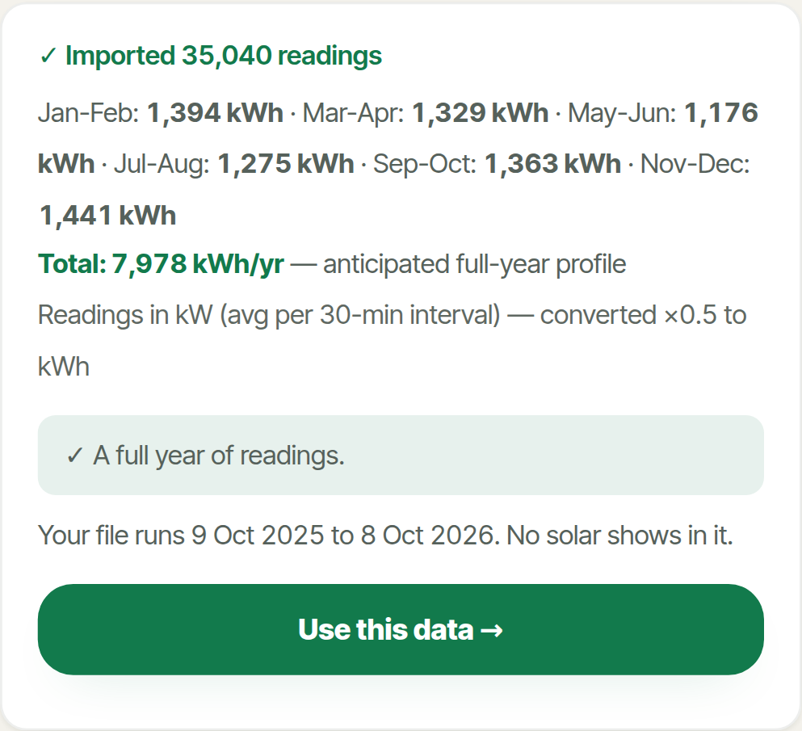
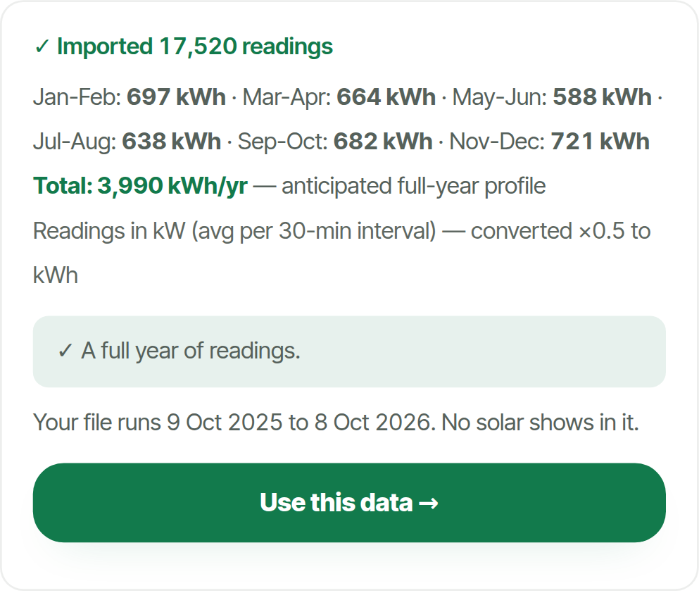
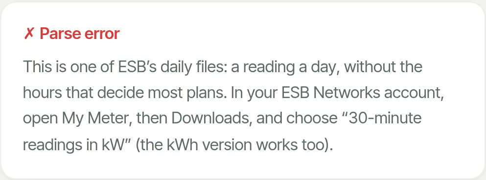
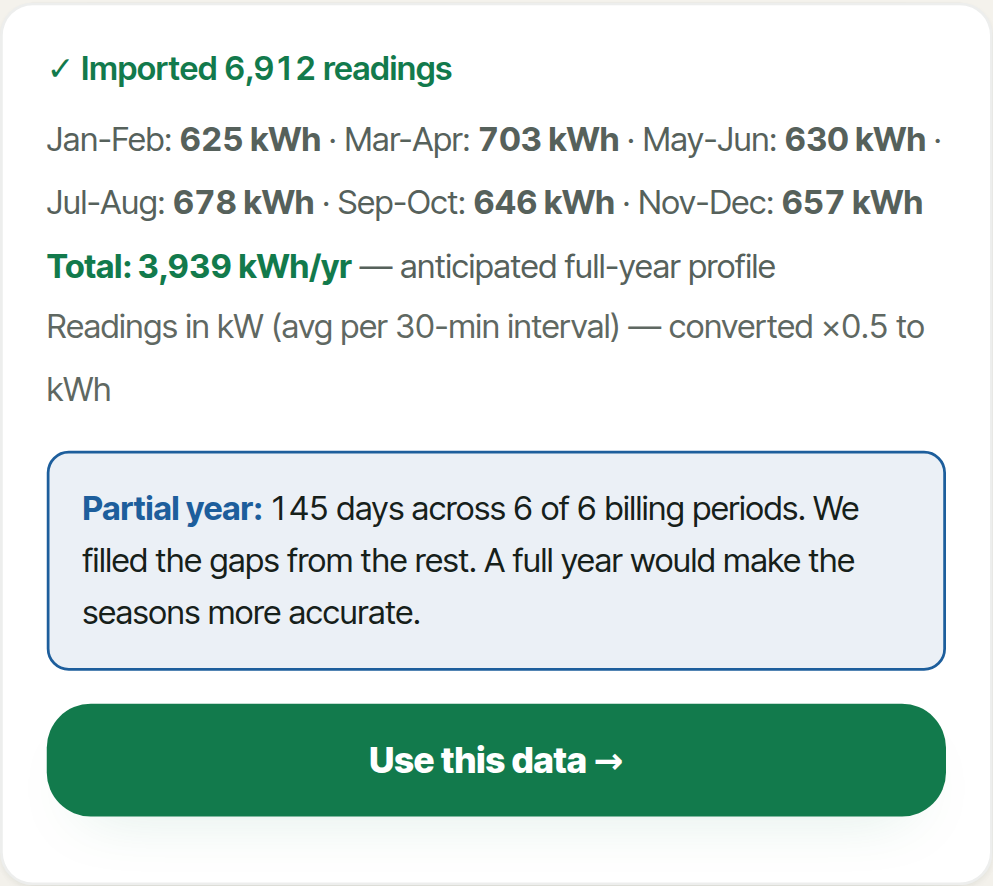

# How Peakless reads ESB meter files

Test report, 9 October 2026, branch `test/meter-file-scenarios` off v8 at d32111d. Test and measurement only: the model and the way a file is reconciled with your answers are unchanged. Every number below comes from a run of the real app against homes whose true use and true costs are known.

## Summary

- **The jump from about 1% to 65–87% came on 6 October, not from the tester fix.** Commit 123f0ba started reading meter files for when the panels went up. A home whose battery soaks up the winter's spare solar exports nothing until spring, so the months before were taken for a home without panels and the panels added on top: the tester-like home's price gap went from 2.8% to 86.6%. The tester fix (3a8346b) cut it to 59.6% but put a 4.5–14.3% gap on files with panels up all year and gave a no-battery home a 14.8-year payback (true 6.77). Today's build (e22e94a) is within 0.2–0.5% on all of them.
- **A full year from a home without panels reads well:** 11 of 12 full-year scenarios pass every tolerance; the one that does not is a heat pump home on calendar 2025 (-5.5% use), a different winter from the year ahead.
- **Five problems that make no sound.** A file that ends on the last day of a two-month period loses that period's neighbour (the last reading is stamped 00:00 the next day and counted as a whole day): nine months ending 28 February read -15.9% for the gas home. Rows that appear twice are counted twice (+99.5%); the same months five times, five times (+396.5%). US-style dates are half read with no warning. A typed yearly figure is replaced by the file without a word. The wrong panel count rebuilds the home's use from the wrong output (+49.9% use, payback 4.1 years against 6.77).
- **The accuracy figure does not move.** It reads ±4% to ±7% for every accepted file, including a four-week winter file that is +73.6% out and a doubled file that is +99.5% out. The import card does warn about short and partial files, once.
- **Short or seasonal files are fine for gas homes and far out for heat pumps:** four summer weeks -7.0% (gas) and -45.2% (heat pump); four winter weeks 0.0% and +73.6%.
- **Solar files without export rows (common in the first weeks) go wrong:** the app proposes a wrong install date, offers no answer that fits, reads use -34.2% and shows no payback.
- **Where the user's answers and the file disagree, the app mostly goes with one of them without saying so:** no solar but exports in the file (-34.2% use, no payback); EV or heat pump added partway (-17.2%, -17.4%); a file from a previous home (+87.1%).
- **A golden-households test now guards this.** 14 reference scenarios run through the real app on every push; on the 6 October build and the tester-fix build it fails the same five solar and battery homes, on today's it passes.

CI note: the brief says CI on v8 fails at the type check. That was fixed this morning (3a8346b); the last three pushes to v8 (3a8346b, e22e94a, d32111d) passed every step. CI runs on v8 and on pull requests, so the golden test starts guarding v8 when this branch is merged or opened as a pull request.

## Step 0: the regression

### The commits

| Commit | When | What it did to a meter file from a home with panels |
|---|---|---|
| ad1de59 | 6 Oct 08:31 | Panels up: the file is priced as recorded. The home's own use is taken to be what it bought, so the "without panels" side of every comparison, and the payback, is worked out on a home far smaller than it is. |
| 123f0ba | 6 Oct 09:25 | Reads the file for when exports begin. If they begin more than two weeks in, the days before are taken to be the home without panels, the stated panels are added to them, and the days after are ignored unless they cover eleven months. A battery home exports nothing in winter, so a year with panels throughout became five winter months "without panels" with panels added again. |
| 5179c9f | 8 Oct | As 123f0ba for meter files. |
| 3a8346b | 9 Oct 09:01 | The tester fix. With exports in the file, every day from the first export is "worked back" to the home's own use (bought + modelled output − sold − battery losses), and every plan, including the home's own system, is priced by simulating the panels again on that use. The home's use came right; its own bills became a model's estimate instead of the readings, and the misread start date stayed. |
| e22e94a | 9 Oct 10:59 | Panels up for the whole file and the stated system unchanged: priced from the readings again; the worked-back use is kept for the use figures and every what-if. If exports start partway, the app asks whether that is when the panels went up instead of assuming. |

### The benchmark homes from the five-way study, on each build

Same homes, same true costs, same frozen prices and date for every build. Price gap: the average gap between the app's yearly cost and the true cost across all 33 plans. € lost: what the app's top plan costs against the truly cheapest. Rows that changed between builds, plus two that did not.

| Home (meter file) | ad1de59 6 Oct 08:31 | 123f0ba 6 Oct 09:25 | 5179c9f 8 Oct | 3a8346b 9 Oct 09:01 | e22e94a 9 Oct 10:59 |
|---|---|---|---|---|---|
| Typical home, 4,200 kWh | 0.12% · €0 | 0.12% · €0 | 0.12% · €0 | 0.12% · €0 | 0.12% · €0 |
| Heat pump, 9,000 kWh | 0.31% · €0 | 0.31% · €0 | 0.31% · €0 | 0.31% · €0 | 0.31% · €0 |
| 4 kWp solar, no battery | 0.32% · €0 | 0.32% · €0 | 0.32% · €0 | 5.1% · €0 | 0.32% · €0 |
| 4 kWp solar + 10 kWh battery | 0.39% · €0 | 81.31% · €0 | 83.62% · €101 | 61.23% · €101 | 0.39% · €0 |
| 6 kWp + 9 kWh battery, put in mid-April (file part before, part after) | 120.79% · €58 | 26.76% · €202 | 21.93% · €101 | 24.09% · €101 | 24.09% · €101 |
| 6 kWp + 10 kWh battery + EV charged 2am-5am | 17.36% · €32 | 75.63% · €32 | 73.44% · €32 | 36.34% · €32 | 0.38% · €0 |

### The new ground-truth homes, on each build

Use: the app's yearly use against the true use. Gap: price gap as above. Payback: the app's against the true one ("none" where the app shows no payback).

| Scenario | ad1de59 | 123f0ba | 5179c9f | 3a8346b | e22e94a |
|---|---|---|---|---|---|
| A1-gas: Calendar year 2025 | -1.5% · 1.0% · 7.1/6.82 | -1.5% · 1.0% · 7.1/6.82 | -1.5% · 1.0% · 7.1/6.82 | -1.5% · 1.0% · 7.1/6.82 | -1.5% · 1.0% · 7.1/6.82 |
| B2-gas_solar: A year after the panels, exports recorded | -34.2% · 0.4% · none/6.77 | -34.2% · 0.4% · none/6.77 | -34.2% · 0.3% · none/6.77 | -1.8% · 4.5% · 14.8/6.77 | -1.8% · 0.3% · 6.9/6.77 |
| B2-hp_solar_batt: A year after the panels, exports recorded | -54.9% · 0.2% · none/6.2 | -54.9% · 0.2% · none/6.2 | -54.9% · 0.2% · none/6.2 | -4.4% · 4.6% · 7.2/6.2 | -4.4% · 0.2% · 7.2/6.2 |
| B3-friend: Panels from 20 Oct 2025, exports recorded only from 1 Dec 2025 (the tester's case) | -40.0% · 2.8% · none/5.72 | -19.4% · 86.6% · 5.4/5.72 | -19.4% · 76.3% · 5.6/5.72 | -15.0% · 59.6% · 8.7/5.72 | +3.7% · 0.5% · 5.9/5.72 |
| B4a-gas_solar: Before and after the panels (12 May 2025), exports recorded; user confirms the date | -20.1% · 56.5% · none/6.77 | -1.8% · 2.0% · 7.0/6.77 | -1.8% · 2.1% · 7.0/6.77 | -2.9% · 3.0% · 9.9/6.77 | -2.9% · 3.0% · 6.9/6.77 |
| B4d-hp_solar_batt: Before and after a battery system (3 Mar 2025), exports recorded; user confirms the date shown | -37.6% · 49.3% · none/6.2 | +3.8% · 10.7% · 5.5/6.2 | +3.8% · 10.7% · 5.3/6.2 | -5.3% · 3.5% · 6.4/6.2 | -5.3% · 3.5% · 5.5/6.2 |
| B5-hp_solar_gridfill: Battery filled from the grid at night in winter | -53.5% · 0.2% · none/5.97 | -53.5% · 0.2% · none/5.97 | -53.5% · 0.2% · none/5.97 | -3.7% · 14.3% · 7.5/5.97 | -3.7% · 0.2% · 7.7/5.97 |
| B6-gas_solar: User says no solar; the file shows exports | -34.2% · 0.4% · none/6.77 | -34.2% · 0.4% · none/6.77 | -34.2% · 0.3% · none/6.77 | -34.2% · 0.3% · none/6.77 | -34.2% · 0.3% · none/6.77 |

Why: before 6 October the readings were priced as they are (good) but the home looked 34–55% smaller than it is, so no payback was shown, which is what the tester saw. 123f0ba broke the files where exports start late (the tester-like home, exports recorded from 1 December). 3a8346b fixed the size of the home but priced the home's own system by simulation, which costs 4–14% on files that were right before, and gave the no-battery home a 14.8-year payback. e22e94a keeps both right.

### What "the app makes them match" does, and when

1. **Two-month totals (every file).** For each two-month period, the readings in it are averaged per day and multiplied by the period's length. Periods with no readings are filled from the average of the others, reshaped by the seasonal profile for the heating type. The import card shows the totals, marks filled periods with *, and says "Partial year" (under 300 days or a period missing) or "Only N days" (under 45 days).
2. **Where the panels are (files with exports or a midday drop, when the person says they have panels).** Exports from the first two weeks and the system unchanged: priced as recorded. Exports from later: asks "Did the panels go up around <date>?". No exports: asks "Is your meter file from before the panels went up?", or with a lasting midday drop, "Did the panels go up around <date>?".
3. **Worked-back use (files with panels in them).** The days after the panels are rebuilt as bought + the stated panels' modelled output − sold − 8% of the solar used, if there is a battery. The two-month totals are replaced with these, and periods the file does not cover are grown by the same ratio (used ÷ bought). This is what turns 2,600 kWh bought into a 4,000 kWh home. It runs on the stated system: a wrong panel count gives a wrong home.
4. **Only part of the file (a file that straddles the install, or a "no solar" answer with exports more than 60 days in).** Only the days before the panels are used, and the totals recomputed from them.
5. **Turning totals into hours.** With at least 330 days, each day of the year is the recorded day nearest the same date on the same weekday. With fewer, the two-month totals are spread on a 70/30 blend of the file's average day and the heating profile. Either way the year is rescaled to the totals.
6. **Typed figures.** Once a file is in, the typed yearly kWh and bill are ignored.

## The test homes

Each home is two years and nine months of half-hour use (1 January 2024 to 8 October 2026), built from its own activity and Cork weather, not from the profiles Peakless uses. Solar output follows the day-to-day weather and is anchored month by month to PVGIS for Cork (south 977, south-west 919, north-east 621 kWh per kWp a year at 35°). The truth is the home as it is now over its last twelve months, priced as the year ahead on the plan list frozen on 9 October 2026, with announced price changes, standing charges, the PSO levy, export at each plan's rate and the tax on export income above €600. Solar saving and payback are counted the way the app counts them: the cheapest plan without the panels less the cheapest with them; the price after grant over that.

| Home | Use, kWh | Bought / sold | Cheapest plan, true cost | System | Saving | Payback, years |
|---|---|---|---|---|---|---|
| Gas-heated home, 4,000 kWh | 4,000 | 4,000 / 0 | Energia Smart 24 Hour, €1,453 | 4.0 kWp, €6,000 after grant (quoted) | €880 | 6.82 |
| Heat pump home, 7,500 kWh, heavy winter | 7,500 | 7,500 / 0 | Energia Smart 24 Hour, €2,476 | 4.0 kWp, €6,000 after grant (quoted) | €1,037 | 5.78 |
| EV charged at night, 6,000 kWh | 6,000 | 6,000 / 0 | Flogas Smart EV Night Charge 29%, €1,785 | 4.0 kWp, €6,000 after grant (quoted) | €934 | 6.43 |
| Gas home, 4 kWp south since 12 May 2025, no battery | 4,000 | 2,639 / 2,585 (makes 3,946) | Electric Ireland Home Electric+ SST Saver 16%, €567 | 4.0 kWp, €6,000 after grant | €887 | 6.77 |
| Heat pump home, 6 kWp + 10 kWh battery since 3 Mar 2025, battery on solar only | 7,500 | 3,386 / 1,692 (makes 5,905) | Electric Ireland Home Electric+ SST Saver 16%, €846 | 6.0 kWp + 10 kWh, €10,100 after grant | €1,630 | 6.2 |
| Heat pump home, 6 kWp + 10 kWh battery, filled from the grid at night Nov-Feb | 7,500 | 3,490 / 1,745 (makes 5,905) | Electric Ireland Home Electric+ SST Saver 16%, €784 | 6.0 kWp + 10 kWh, €10,100 after grant | €1,692 | 5.97 |
| The tester's case, rebuilt: heat pump 6,500 kWh, 22 panels on two faces, 9 kWh battery, panels from 20 Oct 2025, exports recorded from 1 Dec 2025 | 6,500 | 2,686 / 3,484 (makes 7,418) | Electric Ireland Home Electric+ SST Saver 16%, €332 | 9.7 kWp + 9 kWh, €10,600 after grant | €1,852 | 5.72 |
| Gas home that bought an EV on 1 Apr 2026 | 6,400 | 6,400 / 0 | Flogas Smart EV Night Charge 29%, €1,910 | 4.0 kWp, €6,000 after grant (quoted) | €939 | 6.39 |
| Gas home that put in a heat pump on 15 Jan 2026 | 7,900 | 7,900 / 0 | Energia Smart 24 Hour, €2,593 | 4.0 kWp, €6,000 after grant (quoted) | €1,036 | 5.79 |
| Gas home, away 3-30 Aug 2026 | 4,000 | 4,000 / 0 | Energia Smart 24 Hour, €1,453 | 4.0 kWp, €6,000 after grant (quoted) | €880 | 6.82 |

The tester's own file was not available. "The tester's case" is rebuilt from what he described: a heat pump home of about 6,500 kWh in the south, 12 panels south-west and 10 north-east, a 9 kWh battery, panels from 20 October 2025, and (as often happens) exports recorded by ESB only from 1 December. With his file, MPRN and serial removed, it can be added as a scenario.

## Results: every scenario

Tolerances (the brief's): use and bill within 5%, payback within half a year, the best plan or one within €25 a year. For partial and short files the seasons have to be guessed, and we accept 10% (nine months, this year so far) and 15% (two to six weeks) on use and bill, 0.75 and 1 year on payback: wider than that and a plan or payback decision could flip. Bill: the app's yearly cost for its top plan against that plan's true cost. For a home planning panels, plans are compared as the home is today. For a battery that only stores solar, the app's answer for that (given under its headline) is scored; its headline assumes night filling. Accuracy: the "±" figure the app shows.

| ID | Scenario | What the app did | Use | Top plan (€ over cheapest) | Bill | Saving | Payback app / true | Shown | Result |
|---|---|---|---|---|---|---|---|---|---|
| A1-gas | Calendar year 2025 | accepted | -1.5% | Energia Smart 24 Hour | -0.9% | -3.9% | 7.1 / 6.82 | ±4% | pass |
| A1-heatpump | Calendar year 2025 | accepted | -5.5% | Energia Smart 24 Hour | -4.6% | -5.1% | 6.1 / 5.78 | ±4% | FAIL: consumption |
| A1-ev | Calendar year 2025 | accepted | -0.8% | Flogas Smart EV Night Charge 29% | -0.1% | -4.0% | 6.7 / 6.43 | ±4% | pass |
| A2-gas | Twelve months, March 2025 to February 2026 | accepted | -0.9% | Energia Smart 24 Hour | -0.5% | -3.9% | 7.1 / 6.82 | ±4% | pass |
| A2-heatpump | Twelve months, March 2025 to February 2026 | accepted | +0.5% | Energia Smart 24 Hour | +0.6% | -4.7% | 6.1 / 5.78 | ±4% | pass |
| A2-ev | Twelve months, March 2025 to February 2026 | accepted | +1.8% | Flogas Smart EV Night Charge 29% | +0.7% | -4.2% | 6.7 / 6.43 | ±4% | pass |
| A3a-gas | Nine months, June 2025 to February 2026 (no spring) | warned (partial year) | -15.9% | Energia Smart 24 Hour | -12.8% | -3.5% | 7.1 / 6.82 | ±4% | FAIL: consumption, bill |
| A3a-heatpump | Nine months, June 2025 to February 2026 (no spring) | warned (partial year) | -17.8% | Energia Smart 24 Hour | -15.8% | -7.9% | 6.3 / 5.78 | ±4% | FAIL: consumption, bill |
| A3a-ev | Nine months, June 2025 to February 2026 (no spring) | warned (partial year) | -13.3% | Electric Ireland Home Electric+ SST Saver 16% (+€50) | -11.5% | -3.9% | 6.7 / 6.43 | ±4% | FAIL: consumption, bill, plan |
| A3b-gas | Nine months, September 2025 to May 2026 (no summer) | warned (partial year) | -0.9% | Energia Smart 24 Hour | -0.7% | -1.5% | 6.9 / 6.82 | ±4% | pass |
| A3b-heatpump | Nine months, September 2025 to May 2026 (no summer) | warned (partial year) | +8.1% | Energia Smart 24 Hour | +7.2% | +0.3% | 5.8 / 5.78 | ±4% | pass |
| A3b-ev | Nine months, September 2025 to May 2026 (no summer) | warned (partial year) | -2.6% | Electric Ireland Home Electric+ SST Saver 16% (+€50) | -1.8% | -1.8% | 6.5 / 6.43 | ±4% | FAIL: plan |
| A4-gas | This year so far, 1 January to 8 October 2026 | warned (partial year) | 0.0% | Energia Smart 24 Hour | 0.0% | -1.3% | 6.9 / 6.82 | ±4% | pass |
| A4-heatpump | This year so far, 1 January to 8 October 2026 | warned (partial year) | -3.3% | Energia Smart 24 Hour | -2.9% | -3.3% | 6.0 / 5.78 | ±4% | pass |
| A4-ev | This year so far, 1 January to 8 October 2026 | warned (partial year) | +0.6% | Electric Ireland Home Electric+ SST Saver 16% (+€50) | +0.8% | -1.1% | 6.5 / 6.43 | ±4% | FAIL: plan |
| A5a-gas | Four summer weeks, July 2026 | warned (short file) | -7.0% | Energia Smart 24 Hour | -5.6% | -3.7% | 7.1 / 6.82 | ±4% | pass |
| A5a-heatpump | Four summer weeks, July 2026 | warned (short file) | -45.2% | Energia Smart 24 Hour | -40.0% | -13.2% | 6.7 / 5.78 | ±4% | FAIL: consumption, bill |
| A5a-ev | Four summer weeks, July 2026 | warned (short file) | -9.1% | Electric Ireland Home Electric+ SST Saver 16% (+€50) | -7.3% | -1.5% | 6.5 / 6.43 | ±4% | FAIL: plan |
| A5b-gas | Four winter weeks, January 2026 | warned (short file) | 0.0% | Energia Smart 24 Hour | 0.0% | -2.6% | 7.0 / 6.82 | ±4% | pass |
| A5b-heatpump | Four winter weeks, January 2026 | warned (short file) | +73.6% | Energia Smart Data (+€15) | +63.6% | +10.9% | 5.2 / 5.78 | ±4% | FAIL: consumption, bill |
| A5b-ev | Four winter weeks, January 2026 | warned (short file) | -2.1% | Electric Ireland Home Electric+ SST Saver 16% (+€50) | -1.4% | -2.3% | 6.6 / 6.43 | ±4% | FAIL: plan |
| A5c-gas | Two summer weeks, August 2026 | warned (short file) | -8.4% | Energia Smart 24 Hour | -6.8% | -0.4% | 6.8 / 6.82 | ±4% | pass |
| A5c-heatpump | Two summer weeks, August 2026 | warned (short file) | -41.5% | Energia Smart 24 Hour | -36.8% | -11.7% | 6.6 / 5.78 | ±4% | FAIL: consumption, bill |
| A5c-ev | Two summer weeks, August 2026 | warned (short file) | -12.2% | Electric Ireland Home Electric+ SST Saver 16% (+€50) | -9.1% | -0.9% | 6.5 / 6.43 | ±4% | FAIL: plan |
| A6-gas | An old year, July 2024 to June 2025 | accepted | -1.6% | Energia Smart 24 Hour | -1.2% | -4.1% | 7.1 / 6.82 | ±4% | pass |
| A6-heatpump | An old year, July 2024 to June 2025 | accepted | -4.2% | Energia Smart 24 Hour | -3.7% | -4.5% | 6.1 / 5.78 | ±4% | pass |
| A6-ev | An old year, July 2024 to June 2025 | accepted | -0.1% | Flogas Smart EV Night Charge 29% | -0.3% | -4.9% | 6.8 / 6.43 | ±4% | pass |
| A7-gas | Two years, October 2024 to October 2026 | accepted | -0.8% | Energia Smart 24 Hour | 0.0% | -3.7% | 7.1 / 6.82 | ±4% | pass |
| A7-heatpump | Two years, October 2024 to October 2026 | accepted | -2.0% | Energia Smart 24 Hour | +0.1% | -5.0% | 6.1 / 5.78 | ±4% | pass |
| A7-ev | Two years, October 2024 to October 2026 | accepted | +0.6% | Flogas Smart EV Night Charge 29% | 0.0% | -4.5% | 6.7 / 6.43 | ±4% | pass |
| B1a-friend | Full year before the panels | asked "Is your meter file from before the panels went up?" | -4.5% | Electric Ireland Home Electric+ SST Saver 16% | -46.3% | +12.2% | 5.1 / 5.72 | ±4% | FAIL: bill, payback |
| B1b-friend | Half year before the panels | warned (partial year); asked "Is your meter file from before the panels went up?" | -23.7% | Electric Ireland Home Electric+ SST Saver 16% | -145.9% | +6.9% | 5.4 / 5.72 | ±4% | FAIL: consumption, bill |
| B1c-friend | Summer before the panels | warned (partial year); asked "Is your meter file from before the panels went up?" | -55.6% | Pinergy Lifestyle Family Time (+€245) | -220.1% | -0.8% | 5.8 / 5.72 | ±4% | FAIL: consumption, bill, plan |
| B1d-friend | Winter before the panels | warned (partial year); asked "Is your meter file from before the panels went up?" | -14.6% | Electric Ireland Home Electric+ SST Saver 16% | -77.7% | +5.5% | 5.4 / 5.72 | ±4% | FAIL: consumption, bill |
| B2-gas_solar | A year after the panels, exports recorded | accepted | -1.8% | Electric Ireland Home Electric+ SST Saver 16% | 0.0% | -2.3% | 6.9 / 6.77 | ±4% | pass |
| B3-gas_solar | A year after the panels, no export rows | asked "Did the panels go up around 22 Jan 2026?" | -34.2% | Energia Smart 24 Hour (+€11) | +83.0% | — | none / 6.77 | ±4% | FAIL: consumption, bill, no payback shown |
| B2-hp_solar_batt | A year after the panels, exports recorded | accepted | -4.4% | Electric Ireland Home Electric+ SST Saver 16% | +0.1% | -14.3% | 7.2 / 6.2 | ±4% | FAIL: payback |
| B3-hp_solar_batt | A year after the panels, no export rows | asked "Did the panels go up around 5 Feb 2026?" | -54.9% | Electric Ireland Home Electric+ SST Saver 16% | +39.1% | — | none / 6.2 | ±4% | FAIL: consumption, bill, no payback shown |
| B3-friend | Panels from 20 Oct 2025, exports recorded only from 1 Dec 2025 (the tester's case) | asked "Did the panels go up around 27 Feb 2026?" | +3.7% | Electric Ireland Home Electric+ SST Saver 16% | +0.5% | -3.0% | 5.9 / 5.72 | ±4% | pass |
| B4a-gas_solar | Before and after the panels (12 May 2025), exports recorded; user confirms the date | asked "Did the panels go up around 12 May 2025?" | -2.9% | Electric Ireland Home Electric+ SST Saver 16% | -1.9% | -2.5% | 6.9 / 6.77 | ±5% | pass |
| B4b-gas_solar | Same file; user says the panels were up the whole time | asked "Did the panels go up around 12 May 2025?" | +42.2% | Energia Smart 24 Hour (+€11) | +67.1% | +10.6% | 6.1 / 6.77 | ±4% | FAIL: consumption, bill, payback |
| B4c-gas_solar | Before and after the panels, no export rows; user confirms the date shown | asked "Did the panels go up around 14 May 2025?" | -3.0% | Electric Ireland Home Electric+ SST Saver 16% | -0.7% | -3.5% | 7.0 / 6.77 | ±4% | pass |
| B4d-hp_solar_batt | Before and after a battery system (3 Mar 2025), exports recorded; user confirms the date shown | asked "Did the panels go up around 5 Mar 2025?" | -5.3% | Electric Ireland Home Electric+ SST Saver 16% | -6.9% | +12.3% | 5.5 / 6.2 | ±5% | FAIL: consumption, bill, payback |
| B5-hp_solar_gridfill | Battery filled from the grid at night in winter | accepted | -3.7% | Electric Ireland Home Electric+ SST Saver 16% | +0.2% | -22.4% | 7.7 / 5.97 | ±4% | FAIL: payback |
| B6-gas_solar | User says no solar; the file shows exports | accepted | -34.2% | Electric Ireland Home Electric+ SST Saver 16% | 0.0% | — | none / 6.77 | ±7% | FAIL: consumption, no payback shown |
| B7a-gas | User says they have 9 panels; the file shows a home without them (they have none) | asked "Is your meter file from before the panels went up?" | -0.2% | Energia Smart 24 Hour | 0.0% | — | none / 6.82 | ±4% | FAIL: no payback shown |
| B7b-gas | Same; user answers that the file is from before the panels | asked "Is your meter file from before the panels went up?" | -0.2% | Energia Smart 24 Hour | -58.3% | -3.7% | 7.1 / 6.82 | ±4% | FAIL: bill |
| B8-gas_solar | User says 14 panels; the home has 9 | accepted | +49.9% | Electric Ireland Home Electric+ SST Saver 16% | 0.0% | +65.9% | 4.1 / 6.77 | ±4% | FAIL: consumption, payback |
| C1-gas_ev_now | EV bought on 1 Apr 2026, halfway through the file | accepted | -17.2% | Electric Ireland Home Electric+ SST Saver 16% (+€51) | -10.1% | -2.3% | 6.5 / 6.39 | ±4% | FAIL: consumption, bill, plan |
| C2-gas_to_hp | Heat pump put in on 15 Jan 2026 (was gas) | accepted | -17.4% | Energia Smart 24 Hour | -15.4% | -8.7% | 6.3 / 5.79 | ±4% | FAIL: consumption, bill |
| C4-gas_holiday | Away for four weeks in August 2026 | accepted | -5.2% | Energia Smart 24 Hour | -4.0% | -4.6% | 7.2 / 6.82 | ±4% | FAIL: consumption |
| C3-moved | Moved house: the file is the old (heat pump) home; the new home is gas-heated | accepted | +87.1% | Energia Smart 24 Hour | +70.5% | +12.0% | 6.1 / 6.82 | ±4% | FAIL: consumption, bill, payback |
| D1a-gas | Daily register file instead of half-hourly | Rejected: This is one of ESB’s daily files: a reading a day, without the hours that decide most plans | — | — | — | — | — | — | n/a |
| D1b-gas | Half-hourly file in kWh, not kW | accepted | -0.3% | Energia Smart 24 Hour | 0.0% | -3.7% | 7.1 / 6.82 | ±4% | pass |
| D1c-gas | Day and night register file (24-hour or night-storage meter) | Rejected: This is one of ESB’s daily files: a reading a day, without the hours that decide most plans | — | — | — | — | — | — | n/a |
| D2a-gas | Edited in Excel: US dates (MM/DD) | warned (partial year) | -1.5% | Energia Smart 24 Hour | -1.2% | -1.0% | 6.9 / 6.82 | ±4% | pass |
| D2b-gas | Edited in Excel: semicolons and comma decimals | Rejected: Only 0 readings found. Is this the file from ESB Networks? | — | — | — | — | — | — | n/a |
| D2c-gas | Header row renamed | Rejected: Only 0 readings found. Is this the file from ESB Networks? | — | — | — | — | — | — | n/a |
| D2d-gas | Saved by Excel with Irish short dates (d/m/yyyy h:mm) | accepted | -0.2% | Energia Smart 24 Hour | 0.0% | -3.7% | 7.1 / 6.82 | ±4% | pass |
| D3a-gas | Missing days: ten single days and a three-week gap | accepted | -0.8% | Energia Smart 24 Hour | -2.6% | -4.2% | 7.1 / 6.82 | ±4% | pass |
| D3b-gas | Every row twice | accepted | +99.5% | Energia Smart 24 Hour | +80.3% | +4.1% | 6.6 / 6.82 | ±4% | FAIL: consumption, bill |
| D3c-gas | Two overlapping files uploaded one after the other | warned (partial year) | -0.8% | Energia Smart 24 Hour | 0.0% | -3.7% | 7.1 / 6.82 | ±4% | pass |
| D3d-gas | Meter replaced in March: two serial numbers in one file | accepted | -0.2% | Energia Smart 24 Hour | 0.0% | -3.7% | 7.1 / 6.82 | ±4% | pass |
| D4-gas | Calendar 2024: 29 February and both clock changes | accepted | -1.2% | Energia Smart 24 Hour | -1.0% | -4.0% | 7.1 / 6.82 | ±4% | pass |
| D5a-gas | Empty file | Rejected: File appears empty or invalid | — | — | — | — | — | — | n/a |
| D5b-gas | Header only | Rejected: File appears empty or invalid | — | — | — | — | — | — | n/a |
| D5c-gas | A bank statement CSV | Rejected: This is one of ESB’s daily files: a reading a day, without the hours that decide most plans | — | — | — | — | — | — | n/a |
| D5d-gas | A gas meter file | Rejected: This is one of ESB’s daily files: a reading a day, without the hours that decide most plans | — | — | — | — | — | — | n/a |
| D5e-gas | A PDF bill renamed .csv | Rejected: Only 0 readings found. Is this the file from ESB Networks? | — | — | — | — | — | — | n/a |
| D5f-gas | A very large file (the same 33 months five times, about 14 MB) | accepted | +396.5% | Energia Smart 24 Hour | +321.4% | +15.0% | 5.9 / 6.82 | ±4% | FAIL: consumption, bill, payback |
| D6-gas | Typed 5,600 kWh in setup, then uploaded a file showing 4,000 | accepted | -0.2% | Energia Smart 24 Hour | 0.0% | -3.7% | 7.1 / 6.82 | ±4% | pass |

By group: A: 18 pass, 12 fail, 0 rejected; B: 4 pass, 14 fail, 0 rejected; C: 0 pass, 4 fail, 0 rejected; D: 8 pass, 2 fail, 9 rejected.

## What the user sees

*Nine months ending 28 February: March–April shows 4 kWh and "6 of 6 billing periods"; the year reads -15.9%.*

*Four winter weeks of a heat pump home: warned once, then ±4% on every figure; the year reads +73.6%.*

*Panels up all year, ESB not recording exports: a wrong date, and neither answer is true.*

*A file that straddles the install: the right date proposed, and the right answer available.*

*Every row twice: "A full year of readings", +99.5%, no warning.*

*5,600 kWh typed in setup, then this file: the typed figure is replaced without a word.*

*A bank statement is called "one of ESB's daily files".*

*US-style dates: 6,912 of 17,520 readings read, shown as a "Partial year".*

## User errors: how the app handles them

| What the person did | What the app did | What it says about trust | How wrong |
|---|---|---|---|
| Says the panels were up all along; they went up in May | asked "Did the panels go up around 12 May 2025?" | ±4% | use +42.2%, bill +67.1%, payback 6.1 vs 6.77 |
| Says no solar; the file shows exports from the first day | accepted | ±7% (says "Meter file shows panels already running") | use -34.2%, bill 0.0%, payback none vs 6.77 |
| Says 9 panels; there are none | asked "Is your meter file from before the panels went up?" | ±4% | use -0.2%, bill 0.0%, payback none vs 6.82 |
| Says 9 panels and that the file is from before them; there are none | asked "Is your meter file from before the panels went up?" | ±4% | use -0.2%, bill -58.3%, payback 7.1 vs 6.82 |
| Says 14 panels; there are 9 | accepted | ±4% | use +49.9%, bill 0.0%, payback 4.1 vs 6.77 |
| Uploads the file from the house they left | accepted | ±4% | use +87.1%, bill +70.5%, payback 6.1 vs 6.82 |
| Typed 5,600 kWh, then uploads a file showing 4,000 | accepted | ±4% | use -0.2%, bill 0.0%, payback 7.1 vs 6.82 |
| Opened and saved the file in Excel with US dates | warned (partial year) | ±4% | use -1.5%, bill -1.2%, payback 6.9 vs 6.82 |
| File with every row twice | accepted | ±4% | use +99.5%, bill +80.3%, payback 6.6 vs 6.82 |
| Two overlapping files, one after the other | warned (partial year) | ±4% | use -0.8%, bill 0.0%, payback 7.1 vs 6.82 |
| Excel with semicolons and comma decimals | Rejected: Only 0 readings found. Is this the file from ESB Networks? | Turned away | — |
| Header row renamed | Rejected: Only 0 readings found. Is this the file from ESB Networks? | Turned away | — |
| A bank statement | Rejected: This is one of ESB’s daily files: a reading a day, without the hours that decide most plans | Turned away | — |
| A gas meter file | Rejected: This is one of ESB’s daily files: a reading a day, without the hours that decide most plans | Turned away | — |
| A PDF renamed .csv | Rejected: Only 0 readings found. Is this the file from ESB Networks? | Turned away | — |
| An empty file | Rejected: File appears empty or invalid | Turned away | — |

## Questions answered

### 1. How each group is handled today

- **No panels yet, last year's file (A).** The file is read into six two-month totals (per-day average × days in the period), missing periods filled from the others on the seasonal profile; with 330+ days the year is the real days, otherwise the totals spread on an average day. Full years land within 0.1–5.5% on use. Partial years are right when they end mid-period and wrong when they end on a period's last day (the midnight bug). Under 330 days the EV home loses its night charging pattern and is offered the wrong plan (+€50 a year). Two years: the per-day averages use both, the hours use the latest.
- **Panels already up (B).** If the file shows exports from the start and the stated system has not changed, the readings are priced as they are and the home's use is worked back. If exports start later, or there are none, it asks one question, the answer decides which days are 'before' and which are priced. With a battery, setup does not ask how it charges once a file is in, and the headline assumes it is filled at night.
- **The home changed in the file (C).** Nothing looks for it. An EV or heat pump added partway is averaged into the year (about 17% low), a holiday is averaged in, and a file from a previous home is taken as this one.
- **File problems (D).** Daily files, empty files and files it cannot parse are turned away with a message (two of the messages are wrong about what the file is). kWh files, gaps, a replaced meter, two overlapping uploads, the leap day and both clock changes are handled. Duplicated rows and US dates get through silently.

### 2. What period the figures represent

A modelled year: the file's days (or its two-month totals) laid on a calendar year, priced at today's prices with announced changes from their dates. In effect, "the next twelve months, if they are like the file's year". Home and Plans say "a year"; a few places say "a typical year"; the import card says "anticipated full-year profile" and, for files over 400 days, "averaged per day, so the result is one typical year". Nothing says which months the figures stand for or that weather is not adjusted. A person should expect the twelve-month total of their bills to match within the error shown here when the coming year is like the file's; individual two-month bills will not match, because winter and summer differ.

### 3. How a partial or seasonal file becomes a year

Each two-month period with readings is its per-day average × its length. A period with none is the average of the covered periods × (that period's share in the seasonal profile ÷ the average share). Gas homes use ESB's standard load profile (urban or rural); heat pump and storage homes their own winter-heavy profiles. For a gas home this is close: four weeks of summer -7.0%, four weeks of winter 0.0%. For a heat pump it is far out: summer -45.2%, winter +73.6%, because the profile's winter-to-summer ratio is much flatter than a real heat pump's and nothing adjusts for the weather of the weeks in the file.

### 4. Solar homes: rebuilding use from imports, and missing exports

Use is worked back month by month: what was bought, plus what the stated panels make in a typical year for that month, less what was sold, less 8% of the solar used where there is a battery. Without a battery the night hours are the meter's own and the solar used is put into daylight hours; with one, each day's total is spread on the home's own shape from before the panels (if there are three weeks of it) blended with the heating profile. It is right when the stated system is right (-1.8% for the 4 kWp home) and wrong in step with the system when it is not (+49.9% with 14 panels stated for 9). With no export rows, the app either asks whether the file is from before the panels or, if the midday buying drops, proposes a date; answering that the system never exports prices the readings as they are, reads use as what was bought (-34.2% and -54.9%), leaves out the export income the coming year will pay (bill +83.0%) and shows no payback.

### 5. Where the app changes the data or the answers without showing it

- Fills missing two-month periods from the others (shown with * on the import card, not afterwards).
- Counts a lone midnight reading as a whole day of the next period (the bug above): silent.
- Adds up rows that appear twice: silent.
- Reads US-style dates as Irish ones, dropping the days that cannot be months: shown only as "Partial year".
- Merges a new upload with earlier ones (latest 400 days kept) while the yearly totals come from the newest file alone: silent.
- Replaces a typed yearly kWh or bill with the file: silent.
- Rebuilds the home's use from the stated panels, and grows the periods the file does not cover by the same ratio: one line in the accuracy panel ("worked back").
- Uses only the days before the panels when a file straddles them, or when the person says no solar but exports appear after 60 days: the import card says which days; the accuracy panel says "Meter file shows panels already running".
- Assumes a battery is filled from the grid at night when a file is in (the question is skipped): the Plans page says so and gives the solar-only answer.
- Credits export income from the file to a home said to have no panels: silent.
- Skips readings below 0 or above 50 kW: silent (the count is not shown).
- Moves each day to the nearest same weekday within three days and takes the latest year when there are two: silent, and harmless in these runs.

## Risk register

| Risk | When it happens | How wrong | How likely | Today | Proposed fix |
|---|---|---|---|---|---|
| Last reading of a period counted as a day of the next | A file ending on the last day of Feb, Apr, Jun, Aug, Oct or Dec (a calendar-year download ends 31 Dec) | -15.9% to -17.8% (nine months); -1.5% (calendar year) | High | Silent | Date each reading by the start of its half hour in the totals, as the hourly ledger already does |
| Duplicate rows counted twice | Files joined in Excel, re-downloads appended | +99.5%; +396.5% for five copies | Low–medium | Silent, "A full year of readings" | Keep one reading per half hour and type; say how many duplicates were dropped |
| Short or seasonal file for a heat pump home | New meters, recent movers, partial downloads | -45.2% to +73.6% | Medium | Warned once; accuracy stays ±4% | Scale with degree days for heat pumps; widen the accuracy figure with coverage; ask for a bill to anchor |
| Accuracy figure ignores coverage and contradictions | Any short, partial, doubled or contradicted file | Shows ±4% on results up to +396.5% out | High | — | Work the file part of the accuracy figure out from days covered, periods filled, duplicates and unresolved questions |
| Under 330 days loses when things happen | EV, night storage, any timed load with a partial file | Wrong plan, +€50 a year (EV) | Medium | Silent | Spread each month on that month's own recorded days instead of one blended average day |
| Solar file without export rows | First weeks after an install; export not yet registered | use -34.2%, bill +83.0%, no payback | High for new installs | Wrong date proposed; no answer fits | Add "Panels were up the whole time; exports aren't on the file yet"; model the exports for the coming year |
| No solar said, exports in the file | Person unsure, or forgot | use -34.2%, no payback | Medium | Accuracy panel only | Ask: "Your file shows power sent to the grid from <date>. Do you have panels?" |
| Wrong panel count | Typing from memory | use +49.9%, payback 4.1 vs 6.77 | Medium | Silent | Compare expected and recorded exports; ask when they differ by more than about a third |
| Home changed in the file | EV bought, heat pump fitted, extension | -17.2% / -17.4%; EV plan +€51 | Medium | Silent | Look for a lasting step in use or in night use; ask "Did something change around <date>?" and price the part after |
| File from another home | Moved house, landlord's file | +87.1% | Low | Silent | One question after upload: "Is this file from the home you live in now?" |
| Typed figure replaced by the file | Typed first, uploaded later | The figure the person gave is dropped | Medium | Silent | Say "Your file says 3,990 kWh; you told us 5,600. We'll use the file." with an undo |
| Misread or misnamed files | Excel edits, wrong downloads | US dates half read; semicolon and renamed-header files refused as "0 readings"; a bank or gas file called an ESB daily file | Medium | Mixed | Accept semicolons and comma decimals; spot day-month order; find columns by content; name what the file looks like |
| Battery charging assumed with a file | Battery homes uploading a file | headline plan +€118 a year if the battery is not filled at night (tester's case) | Medium | Plans page gives both answers; setup does not ask | Ask how the battery charges whatever the input |
| Weather of the file's year | Heat pump homes, any single year | -5.5% (calendar 2025) | High, small | Not adjusted, not said | Degree-day adjustment for heating; say which months the figures stand for |

## Proposed fixes, ranked

Impact is how much wrong answers would fall, across how many people; effort is a rough size. None is implemented; each needs your approval. Each should come with its scenario added to the golden households, and the golden limits tightened where it closes a gap.

| # | Fix | Impact | Effort | Scenarios it fixes |
|---|---|---|---|---|
| 1 | Date readings by the start of their half hour in the two-month totals | High | Small | A3a, A1 (and every file ending on a period boundary) |
| 2 | Drop duplicate readings and say so | High when it happens | Small | D3b, D5f |
| 3 | Make the accuracy figure reflect coverage, filled periods, duplicates and open questions | High | Small | A3–A5, B3, B6, C, D |
| 4 | Ask instead of overriding: typed vs file, no-solar-but-exports, "is this file from this home?" | Medium–high | Small | D6, B6, C3 |
| 5 | Solar file without exports: a true answer option, and expected exports modelled | High for new installs | Medium | B3 |
| 6 | Ask how a battery charges also when a file is uploaded | Medium | Small | B1, B4d |
| 7 | Cross-check the stated panels against recorded exports | Medium | Medium | B8, B7 |
| 8 | Partial files: month-specific days for timing; degree days for heat pumps | Medium–high | Medium–large | A3–A5 (EV and heat pump), C4 |
| 9 | Spot a step change in the file and ask | Medium | Medium | C1, C2 |
| 10 | Parser: semicolons, comma decimals, day-month order, columns by content, clearer refusals | Low–medium | Small | D2a–D2c, D5c, D5d |
| 11 | Weather adjustment and saying which months the figures stand for | Low–medium | Large | A1-heatpump |

## The golden households

`tests/e2e/golden-households.spec.js` runs 14 scenarios through the real app with the plan list and the date frozen, and compares with the stored truth. Limits are in `tests/fixtures/meter-scenarios/golden.json`: the agreed tolerance where the app meets it today; where it does not yet, today's error with a 5% margin, marked as a known gap, so a change can only make it better. Run on the 6 October build and on the tester-fix build, it fails B2-gas_solar, B2-hp_solar_batt, B3-friend, B4a-gas_solar and B5-hp_solar_gridfill; on today's build all 14 pass.

| Scenario | Limits (use / bill / plan / payback) | Known gap |
|---|---|---|
| A1-gas | 5.0% / 5.0% / €25 / 0.5 y |  |
| A2-heatpump | 5.0% / 5.0% / €25 / 0.5 y |  |
| A7-ev | 5.0% / 5.0% / €25 / 0.5 y |  |
| A3a-gas | 17.5% / 14.0% / €25 / 0.5 y | kwh, bill |
| A5b-heatpump | 78.0% / 67.5% / €25 / 0.8 y | kwh, bill, payback |
| B2-gas_solar | 5.0% / 5.0% / €25 / 0.5 y |  |
| B2-hp_solar_batt | 5.0% / 5.0% / €25 / 1.2 y | payback |
| B3-friend | 5.0% / 5.0% / €25 / 0.5 y |  |
| B4a-gas_solar | 5.0% / 5.0% / €25 / 0.5 y |  |
| B5-hp_solar_gridfill | 5.0% / 5.0% / €25 / 1.9 y | payback |
| C1-gas_ev_now | 19.0% / 11.5% / €60 / 0.5 y | kwh, bill, plan |
| D3b-gas | 105.0% / 85.0% / €25 / 0.5 y | kwh, bill |
| D3c-gas | 5.0% / 5.0% / €25 / 0.5 y |  |
| D5e-gas | must be turned away |  |

## How it was run

Scenarios: `python3 tests/fixtures/meter-scenarios/build.py` writes the homes, truth and files (seeded; the same bytes every time). `SCENARIO_OUT=<dir> npx playwright test meter-scenarios --grep @scenarios` runs all 71 through the app as a person would: setup, upload, the questions it asks answered from the scenario (only from the options on screen; where none is true, the nearest), the stated system set in My system. `python3 tests/fixtures/meter-scenarios/score.py <dir>` compares with the truth. Step 0 ran the same benchmark on five builds checked out side by side, each serving its own copy of the app, with the plan list and the date frozen identically.

Limits. The homes are synthetic: their use comes from an activity model and Cork weather, their solar from that weather anchored to PVGIS. The reference battery is idealised (95% charging efficiency, no reserve), which accounts for part of the gap on the tester-like home with a file from before the panels (B1). The scenarios cover one region and one plan list. The tester's real file was not available.
